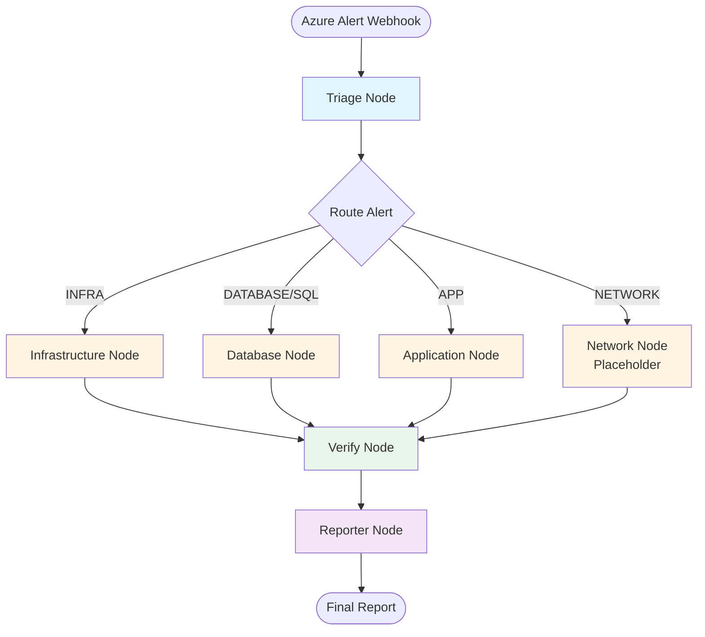

# Architecture Overview

## Introduction

The Azure SRE Agent is a multi-agent system built with **LangGraph** that automatically triages, investigates, and reports on Azure Monitor alerts. The system processes alerts for three main categories: **Infrastructure**, **SQL/Database**, and **Application** anomalies.

The agent uses a state machine workflow where each node performs specialized tasks, and the state is passed between nodes to accumulate investigation results and generate a final incident report.

## System Overview

The agent receives Azure Monitor webhook alerts via a FastAPI endpoint, processes them through a LangGraph workflow, and returns a structured investigation report. The system leverages:

- **LangGraph**: For orchestrating the multi-node workflow
- **LangChain + Ollama**: For LLM-based classification and analysis
- **Azure Monitor Query API**: For executing KQL queries against Log Analytics workspaces
- **Azure Monitor Management API**: For fetching real-time metrics

## Workflow Diagram

The following Mermaid diagram illustrates the complete workflow:



## Node Dictionary

### 1. Triage Node (`triage_node`)

**Purpose**: Classifies incoming alerts into one of four categories.

**Location**: `app/graph/nodes/triage.py`

**Functionality**:
- Uses the `qwen3-vl:4b` model to analyze alert rule names and descriptions
- Classifies alerts into: `INFRA`, `DATABASE`, `NETWORK`, or `APP`
- Implements keyword-based fallback heuristics if LLM classification fails
- Sets the `classification` field in the agent state

**Key Features**:
- Validates LLM output against known categories
- Falls back to keyword matching for reliability (e.g., "CPU", "Memory" → INFRA)
- Defaults to `APP` category if classification is uncertain

### 2. Specialist Nodes

#### Infrastructure Node (`infra_node`)

**Purpose**: Investigates infrastructure-related alerts (CPU, Memory, Disk, Container, VM issues).

**Location**: `app/graph/nodes/infra.py`

**Functionality**:
- **Metrics Check**: Fetches real-time metrics (CPU%, Memory%, RestartCount, Requests)
- **Smart Short-Circuit**: If metrics are healthy (<90% threshold), skips log analysis
- **Deep Investigation**: If metrics exceed thresholds, executes KQL queries using templates
- Uses `gemma3:27b` model for template selection and analysis

**Key Metrics Monitored**:
- `CpuPercentage`: CPU utilization
- `MemoryPercentage`: Memory utilization
- `RestartCount`: Container/VM restart events
- `Requests`: Request rate

#### Database Node (`db_node`)

**Purpose**: Investigates SQL and database-related alerts.

**Location**: `app/graph/nodes/database.py`

**Functionality**:
- Checks SQL-specific metrics: DTU consumption, CPU percentage, storage percentage
- Generates a summary report using the `qwen3-vl:4b` model
- Focuses on resource utilization metrics rather than log analysis

**Key Metrics Monitored**:
- `dtu_consumption_percent`: Database Transaction Unit usage
- `cpu_percent`: Database CPU utilization
- `storage_percent`: Storage utilization

#### Application Node (`app_node`)

**Purpose**: Performs deep-dive diagnostics on application exceptions and errors.

**Location**: `app/graph/nodes/app.py`

**Functionality**:
- Executes a **four-part diagnostic suite**:
  1. **Impact Analysis** (`app_impact_analysis`): Unified telemetry query that unions all Application Insights tables (AppRequests, AppExceptions, AppDependencies, AppTraces, AppPageViews, AppAvailabilityResults, AppEvents) to get a comprehensive view of application health
  2. **Pattern Recognition** (`app_patterns`): Uses unified diagnostics to identify common patterns in failed requests (browser, OS, city, etc.)
  3. **Dependency Failures** (`dependency_failures`): Correlates failed requests with downstream dependency failures by joining AppRequests and AppDependencies on OperationId to identify root causes
  4. **Recent Changes** (`recent_changes`): Checks AzureActivity logs for recent deployments and configuration changes that might have triggered the issue
- Uses `gemma3:27b` model for root cause analysis
- Handles KQL errors gracefully (e.g., `BadArgumentError`)
- Generates Azure Portal deep links to specific OperationIds for manual investigation

**KQL Templates Used**:
- `app_impact_analysis` (maps to `unified_diagnostics`): Unified telemetry query across AppRequests, AppExceptions, AppDependencies, AppTraces, AppPageViews, AppAvailabilityResults, and AppEvents
- `app_patterns` (maps to `unified_diagnostics`): ML-based pattern matching using autocluster
- `dependency_failures`: Correlation with downstream services by joining AppRequests and AppDependencies on OperationId
- `recent_changes`: Checks AzureActivity for recent deployments and configuration changes

#### Network Node (`network_placeholder_node`)

**Purpose**: Placeholder for network investigation (pending implementation).

**Location**: `app/graph/workflow.py`

**Functionality**:
- Returns a consistent state structure indicating network investigation is skipped
- Maintains workflow compatibility while network features are developed

### 3. Verify Node (`verify_node`)

**Purpose**: Double-checks alert status before generating the final report.

**Location**: `app/graph/nodes/verify.py`

**Functionality**:
- **For INFRA alerts**: Re-checks CPU and Memory metrics over the last 15 minutes
- **For APP/SQL alerts**: Queries logs to verify if errors are still active
- Prevents false positives by confirming the alert condition still exists
- Uses KQL injection protection via `validate_and_escape_kql_string()`

**Verification Strategies**:
- Infrastructure: Real-time metric checks
- Application/SQL: Log count queries with 15-minute lookback window

### 4. Reporter Node (`reporter_node`)

**Purpose**: Synthesizes investigation results into a professional incident report.

**Location**: `app/graph/nodes/reporter.py`

**Functionality**:
- Formats investigation steps into a bulleted list
- Uses `qwen3-vl:4b` model to generate a structured Markdown report
- Report format includes:
  - **Classification**: Alert category
  - **Summary**: 2-sentence overview
  - **Evidence**: Key logs or metrics found
  - **Recommendation**: Actionable next steps

## State Management

The workflow uses a `TypedDict` state (`AgentState`) that is passed between nodes:

```python
class AgentState(TypedDict, total=False):
    alert_data: AzureAlertData          # Original alert payload from Azure Monitor
    investigation_steps: List[str]      # Accumulated investigation steps (appended by each node)
    final_report: Optional[str]         # Final formatted report (set by specialist nodes, overwritten by reporter)
    classification: Optional[str]       # Set by triage node (INFRA, DATABASE, NETWORK, or APP)
```

**State Flow**:
1. **Initial State**: Created from webhook payload with empty `investigation_steps` and `None` for `final_report` and `classification`
2. **Triage Node**: Sets `classification` and adds first step to `investigation_steps`
3. **Specialist Nodes**: Add investigation steps and set `final_report` with technical findings
4. **Verify Node**: Adds verification step to `investigation_steps` (does not modify `final_report`)
5. **Reporter Node**: Overwrites `final_report` with a polished, formatted Markdown report

Each node can read from and update the state, allowing information to flow through the workflow. The state is immutable from the node's perspective (nodes return new state dictionaries rather than mutating the existing one).

## Routing Logic

The `route_alert` function in `workflow.py` determines which specialist node to invoke based on:

1. **Primary**: The `classification` field set by the triage node
2. **Fallback**: Keyword matching on `alertRule` and `monitoringService` if classification is missing

Routing supports:
- `INFRA` → `investigate_infra`
- `DATABASE` / `SQL` → `investigate_db`
- `NETWORK` → `investigate_network`
- Default → `investigate_app`

## Tools and Services

### AzureLogTool (`app/tools/monitor.py`)

- Executes KQL queries against Log Analytics workspaces
- Requires `LOG_WORKSPACE_ID` environment variable
- Returns formatted string tables from query results
- Handles partial/failure query statuses gracefully

### AzureMetricsTool (`app/tools/metrics.py`)

- Fetches Azure Monitor metrics via Management API
- Requires `AZURE_SUBSCRIPTION_ID` environment variable
- Formats metrics into human-readable units (percentages, GiB/MiB, cores)
- Supports custom time ranges (default: 30 minutes)

### KQL Templates (`app/core/kql_templates.py`)

- Pre-defined KQL query templates for common investigation patterns
- Includes strict input sanitization to prevent KQL injection (whitelist validation, dangerous token detection)
- Template system uses enum-based keys with fallback fuzzy matching for backward compatibility
- Templates include:
  - `container_logs`: Container Apps console logs from ContainerAppConsoleLogs table
  - `unified_diagnostics`: Unions all Application Insights tables (AppRequests, AppExceptions, AppDependencies, AppTraces, AppPageViews, AppAvailabilityResults, AppEvents) with consistent column mapping
  - `dependency_failures`: Joins AppRequests and AppDependencies on OperationId to correlate request failures with downstream dependency failures
  - `sql_errors`: SQL error logs from AzureDiagnostics table (Category: SQLErrors or Timeouts)
  - `recent_changes`: AzureActivity logs for recent administrative operations (deployments, config changes)
- Template keys like `app_impact_analysis` and `app_patterns` are automatically mapped to `unified_diagnostics` via fallback logic

## Authentication

The system uses Azure's `DefaultAzureCredential` chain:

- **Local Development**: Uses Azure CLI credentials (`az login`)
- **Docker/Production**: Uses Managed Identity or environment variables
- Credentials are cached via `@lru_cache()` for performance

## LLM Models Used

The system uses different models for different tasks, optimized for performance and accuracy:

- **Triage**: `qwen3-vl:4b` (lightweight, fast classification)
- **Infrastructure Analysis**: `gemma3:27b` (template selection and analysis)
- **Application Analysis**: `gemma3:27b` (root cause analysis)
- **Database Reporting**: `qwen3-vl:4b` (metric summarization)
- **Reporter**: `qwen3-vl:4b` (report synthesis)
- **Main Chat Endpoint**: `gemma3:27b` (general-purpose chat)

All models run via **Ollama** (local LLM server) with `temperature=0` for deterministic outputs.

**Model Configuration**:
- Models can be overridden via environment variables:
  - `OLLAMA_MODEL_TRIAGE` (default: `qwen3-vl:4b`)
  - `OLLAMA_MODEL_ANALYSIS` (default: `gemma3:27b`)
  - `OLLAMA_MODEL_DATABASE` (default: `qwen3-vl:4b`)
  - `OLLAMA_MODEL_REPORTER` (default: `qwen3-vl:4b`)
  - `OLLAMA_MODEL_MAIN` (default: `gemma3:27b`)
- Ollama base URL can be configured via `OLLAMA_BASE_URL` (default: `http://localhost:11434`)
- For Docker deployments, set `OLLAMA_BASE_URL=http://ollama:11434` to connect to the Ollama service container
- See `app/core/ollama_config.py` for configuration details

## API Endpoints

The FastAPI application (`app/main.py`) exposes the following endpoints:

### `POST /webhook/azure`

**Purpose**: Receives Azure Monitor alert webhooks and processes them through the agent workflow.

**Request Body**: `AzureWebhookPayload` (Pydantic model matching Azure Monitor Common Alert Schema)

**Response**:
```json
{
  "classification": "INFRA|DATABASE|APP|NETWORK",
  "report": "Markdown formatted incident report",
  "steps": ["Step 1", "Step 2", ...]
}
```

**Error Responses**:
- `503 Service Unavailable`: Workflow graph not initialized
- `422 Unprocessable Entity`: Invalid payload structure

### `POST /chat`

**Purpose**: Simple chat endpoint for testing LLM connectivity (waits for full response).

**Request Body**:
```json
{
  "message": "Your message here"
}
```

**Response**:
```json
{
  "response": "LLM response text"
}
```

### `POST /stream`

**Purpose**: Streaming chat endpoint that returns responses token-by-token (prevents webhook timeouts on long generations).

**Request Body**: Same as `/chat`

**Response**: `text/event-stream` with streaming chunks

**Note**: The `/chat` and `/stream` endpoints are primarily for testing and development. Production use should focus on the `/webhook/azure` endpoint.

